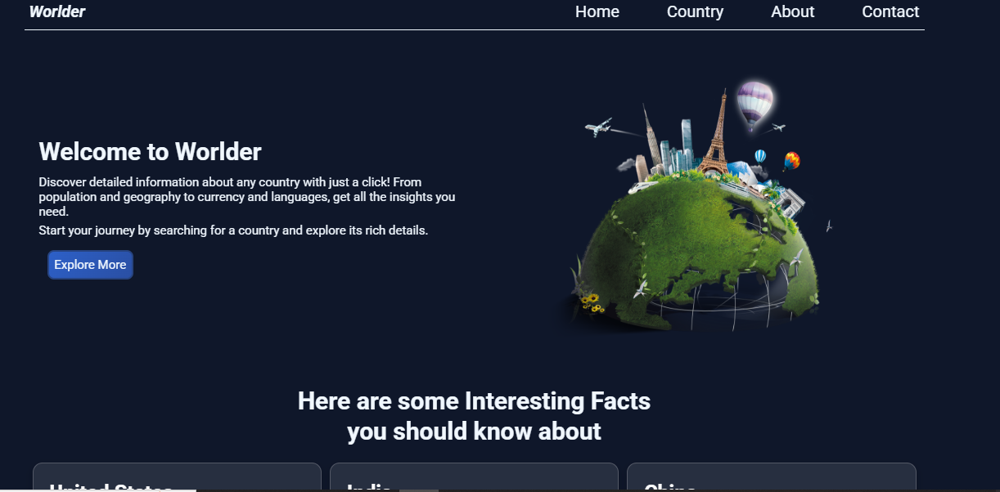
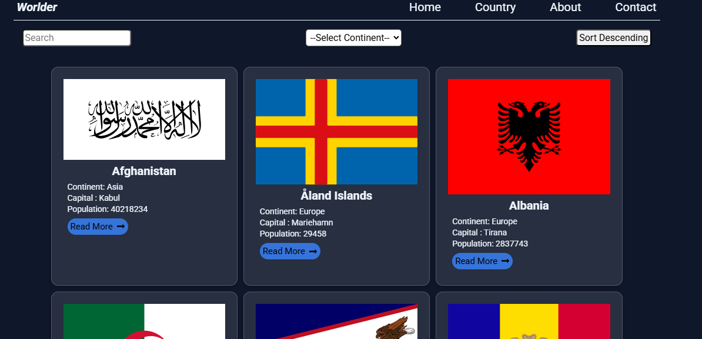
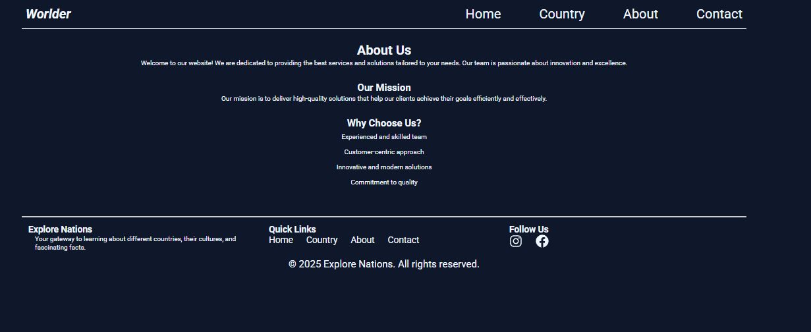
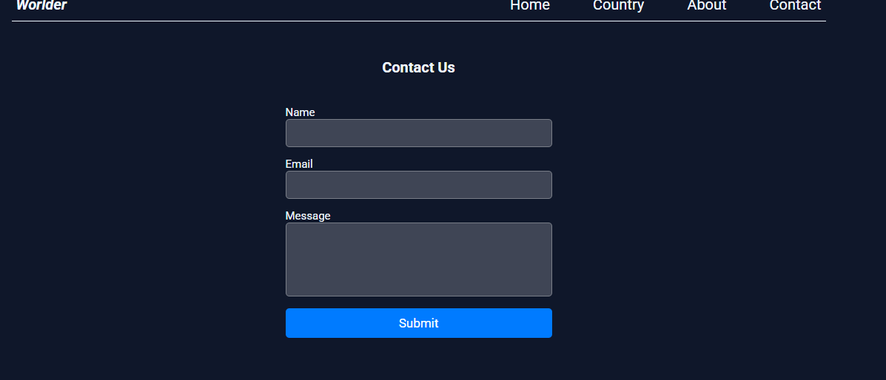

# 🌍 Worlder

A modern **React + Vite** web app that provides detailed information about countries worldwide. Search, explore, and view country details using the **REST Countries API**.

🔗 **Live Demo:** [Worlder](https://worlder-np.netlify.app/)

---

## 📸 Screenshots

### 🏠 Homepage


### 🌎 Country List Page



### ℹ️ About Page


### 📞 Contact Page



---

## ✨ Features

✅ View a list of countries with flags, population, and regions  
✅ Search and filter countries by name  
✅ View detailed country information (currency, languages, borders, etc.)  
✅ Responsive design with dark mode by default  
✅ Fast performance using **Vite**  

---

## 🛠️ Tech Stack

- **Frontend:** React, Vite, Tailwind CSS  
- **API:** [REST Countries API](https://restcountries.com/v3.1/)  

---

## 🚀 Installation & Setup

To run this project locally:

1️⃣ **Clone the repository**  
```sh
git clone https://github.com/yourusername/worlder.git
cd worlder
